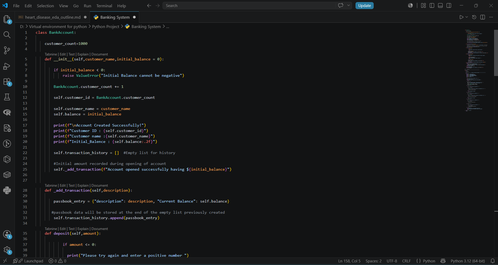
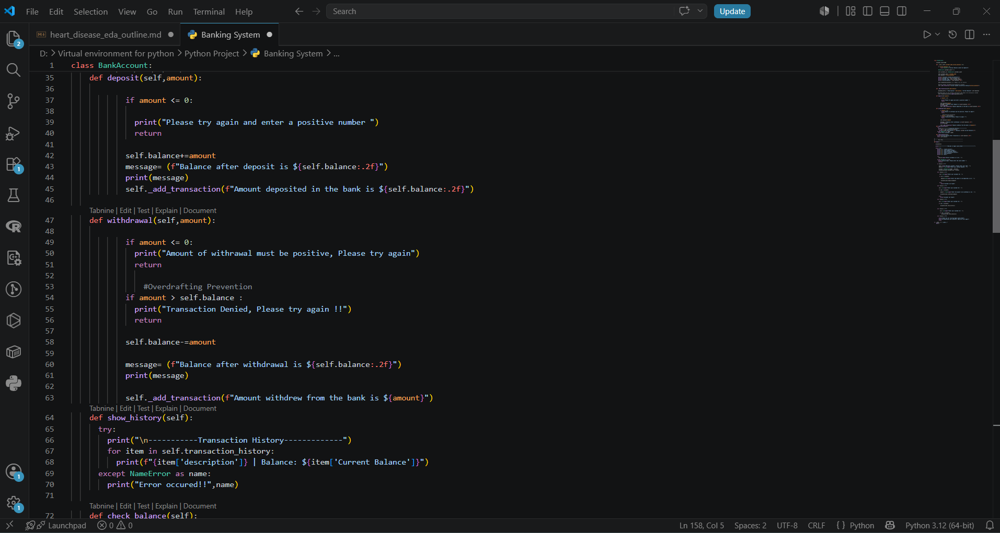
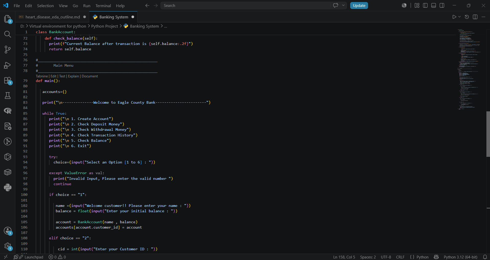
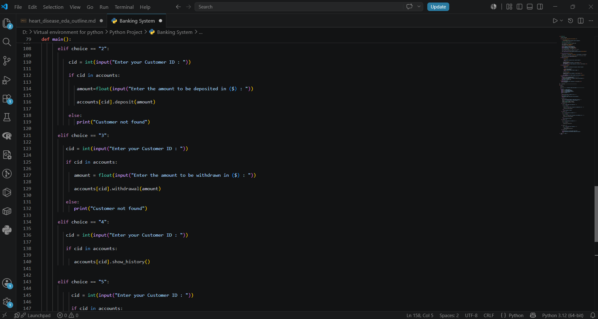
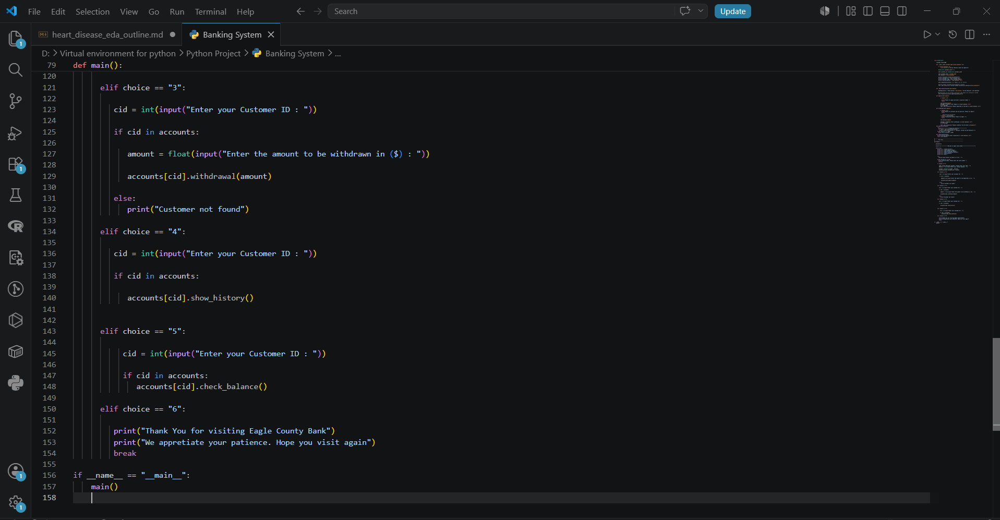
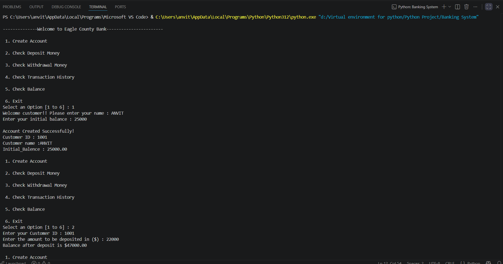
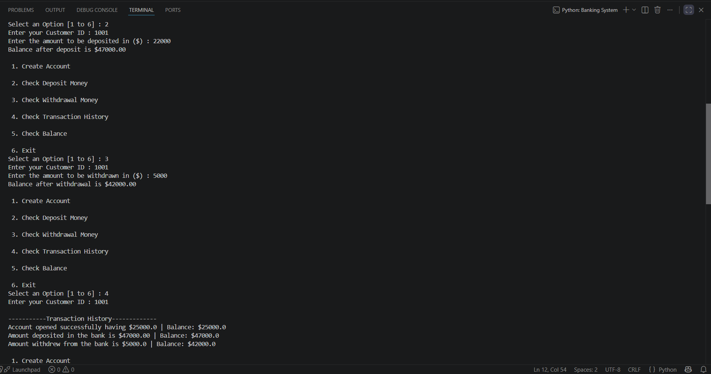
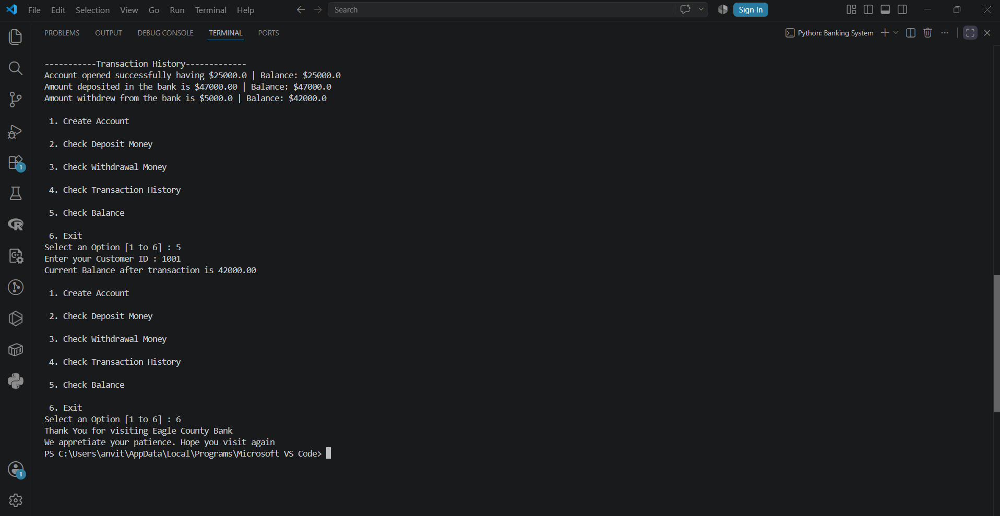

# Eagle County Bank — Menu-Driven Banking System

A command-line banking application in Python that models core account operations — account creation, deposits, withdrawals, transaction history, and balance inquiries — using object-oriented design and a persistent in-session transaction ledger.


---

## Overview

Eagle County Bank is a terminal-based banking system built entirely with core Python (no external libraries). It simulates the essential workflow of a retail bank account: opening an account, depositing and withdrawing funds, reviewing a running transaction history, and checking the current balance — all through a simple numbered menu. The project's goal is to demonstrate clean object-oriented design, defensive input handling, and encapsulated business logic (like automatic account numbering and overdraft prevention) in a single, self-contained Python program.

## Problem / Motivation

Manual, ad-hoc tracking of account transactions is error-prone and doesn't scale. This project addresses that by encapsulating all account state and rules — balance, transaction log, ID assignment, and validation — inside a single `BankAccount` class, so that every deposit or withdrawal is validated and logged consistently rather than handled with scattered, repeated logic. It was built as a hands-on exercise in translating a real-world process (banking operations) into a structured, class-based program with a usable command-line interface.

##  Dataset / Data Source

Not applicable. This is not a data-analysis project — account and transaction data is generated interactively at runtime by the user and held in memory (a Python dictionary) for the duration of the program session; it is not read from or written to an external file or database.

## Methodology / Approach

The system is built around a single `BankAccount` class plus a menu-driven `main()` control loop:

- **Automatic, unique customer IDs** — a class-level counter (`BankAccount.customer_count`, seeded at `1000`) is incremented on every new account, so each customer is assigned a unique sequential ID (e.g., the first account created is ID `1001`).
- **Encapsulated transaction logging** — a private-style helper method, `_add_transaction()`, appends a dictionary (`{"description": ..., "Current Balance": ...}`) to each account's `transaction_history` list. Every deposit, withdrawal, and the initial account funding routes through this single method, keeping the ledger consistent.
- **Input validation** — deposits and withdrawals reject zero/negative amounts, and account creation raises a `ValueError` if the initial balance is negative.
- **Overdraft prevention** — `withdrawal()` explicitly checks `amount > self.balance` and denies the transaction rather than allowing the balance to go negative.
- **Menu-driven CLI loop** — `main()` runs an infinite `while True` loop presenting six options (Create Account, Deposit, Withdraw, Transaction History, Check Balance, Exit), wrapped in a `try/except ValueError` block to gracefully handle non-numeric menu input.
- **In-memory account registry** — all created accounts are stored in a dictionary (`accounts = {}`) keyed by `customer_id`, allowing the menu to look up any account by ID for subsequent operations.

## Tech Stack

| Category | Details |
|---|---|
| Language | Python 3.12 |
| Libraries | None — built entirely with the Python standard library (no third-party packages) |
| Core concepts used | Object-Oriented Programming (classes, instance & class attributes), dictionaries, list-of-dicts as a ledger, f-strings, exception handling (`try/except`), CLI input/output |
| Environment | Developed and tested in Visual Studio Code |

Since the project has no external dependencies, there is no `requirements.txt` — any standard Python 3.6+ installation (f-strings require 3.6+) will run it.

## Key Findings / Results

The screenshots below capture a full, successful end-to-end session:

| Step | Action | Outcome |
|---|---|---|
| 1 | Created account for customer "ANVIT" with an opening balance of $25,000 | System auto-assigned **Customer ID 1001** |
| 2 | Deposited $22,000 | Balance correctly updated to **$47,000.00** |
| 3 | Withdrew $5,000 | Balance correctly updated to **$42,000.00** |
| 4 | Viewed transaction history | All three transactions (open, deposit, withdrawal) listed in order with the running balance at each step |
| 5 | Checked balance | System confirmed a balance of **$42,000.00**, matching the ledger |
| 6 | Selected Exit | Program printed a closing message and terminated cleanly |

This confirms that account creation, ID assignment, balance arithmetic, and transaction logging all behave consistently across a multi-step session.

## Screenshots

**Code — Account creation & unique ID generation**
`BankAccount.__init__()` validates the opening balance, increments the class-level counter to generate a unique customer ID, prints a confirmation, and logs the opening balance as the first transaction.



**Code — Deposit, withdrawal, history & balance methods**
`deposit()` and `withdrawal()` validate the amount and update the balance (with an overdraft check on withdrawals); `show_history()` and `check_balance()` read from the transaction ledger.



**Code — Main menu loop**
The `main()` function initializes the in-memory `accounts` dictionary, prints the welcome banner, and starts the menu loop, handling account creation, deposits, and withdrawals.



**Code — Menu loop (continued)**
The remaining menu branches — transaction history, balance check, and exit — inside the same `while True` loop.



**Code — Program entry point**
The exit branch prints a closing message and `break`s the loop; the `if __name__ == "__main__":` guard starts the program.



**Output — Account creation & deposit**
Creating account "ANVIT" with a $25,000 opening balance (assigned Customer ID 1001), followed by a $22,000 deposit bringing the balance to $47,000.00.



**Output — Withdrawal & transaction history**
A $5,000 withdrawal reduces the balance to $42,000.00; the transaction history option then lists all three logged transactions with their running balances.



**Output — Balance check & exit**
Checking the balance confirms $42,000.00, and selecting Exit prints the closing message and ends the program.



## How to Run / Installation

No external dependencies are required — just a standard Python installation.

1. **Clone the repository**
   ```bash
   git clone https://github.com/<your-username>/eagle-county-bank.git
   cd eagle-county-bank
   ```

2. **Run the program**
   ```bash
   python banking_system.py
   ```

3. **Follow the on-screen menu** to create an account, deposit or withdraw funds, view transaction history, check your balance, or exit.

> Note: All data is held in memory for the session only — restarting the program resets accounts and the ID counter (starting again at customer ID `1001`).

## Project Structure

```
eagle-county-bank/
├── banking_system.py    # BankAccount class + menu-driven main() program
├── README.md             # Project documentation (this file)
└── screenshots/           # Code and terminal output screenshots referenced above
```

## Future Work / Limitations

- **No persistence** — account data lives only in memory (`accounts = {}`) and is lost when the program exits; a file- or database-backed store (e.g., SQLite, JSON) would allow data to survive across sessions.
- **No authentication** — any user can access any customer ID without a PIN or password.
- **Single currency, hardcoded formatting** — amounts are printed with a hardcoded `$` symbol.
- **Limited input validation** — customer names are not checked for empty or invalid input.
- **No automated tests** — the project currently relies on manual/interactive verification (as shown in the screenshots above) rather than a test suite (e.g., `unittest` or `pytest`).
- **CLI only** — a natural extension would be a simple GUI (e.g., Tkinter) or web front end (e.g., Flask).
